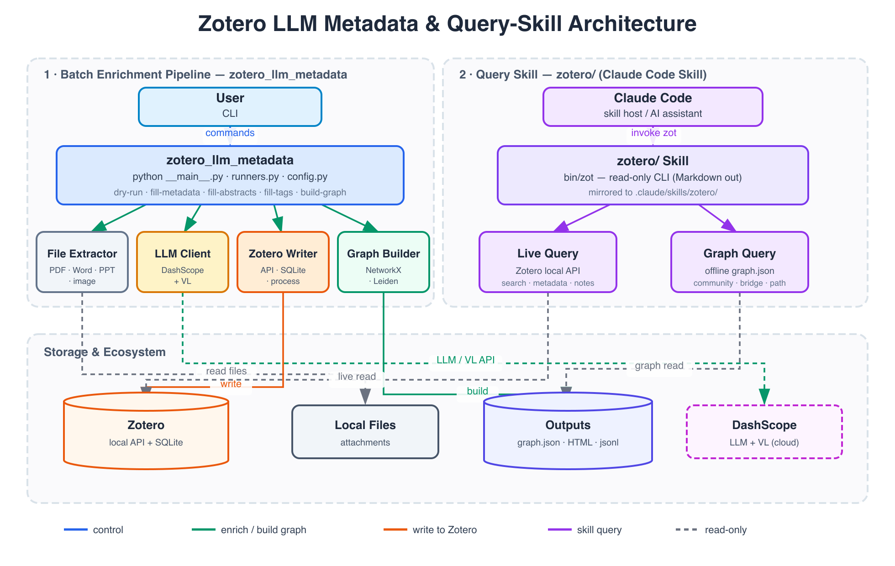

# zotero_llm_metadata

通过 LLM 自动为 Zotero 中的条目提取元数据、补充摘要、生成标签，并在此基础上构建可查询的知识图谱。项目附带一个 **Claude Code 技能**（`zotero/`），可用自然语言只读查询文献库与知识图谱。



> 总体架构：左侧为**批处理增强流水线**（`zotero_llm_metadata`），右侧为**查询技能**（`zotero/`，Claude Code Skill），两者共享 Zotero 库、本地文件与图谱输出。

## 功能

- 扫描无元数据的独立附件，调用 LLM 生成结构化元数据（标题、作者、摘要、DOI 等），通过 Connector 写入 Zotero 并自动挂载父条目
- 为已有条目补充缺失的 `abstractNote`（支持读取附件全文，或通过 VL 模型识别图片）
- 为无标签条目批量生成标签（读取附件全文，调用 LLM 输出结构化 JSON 标签列表）
- 基于集合与标签关系构建知识图谱，运行 Leiden 社区检测，导出可交互的 HTML 可视化
- 以上元数据/摘要步骤均自动管理 Zotero 进程（写入 SQLite 前关闭，写入完成后重启）
- 提供 **Zotero 技能**（Claude Code Skill）：以自然语言只读查询文献库（实时 API）与知识图谱（离线快照）

**支持格式：**

| 类型 | 格式 |
|------|------|
| 文档 | `.pdf` / `.docx` / `.docm` / `.doc`（需 LibreOffice 或 antiword） |
| 表格 | `.xlsx` / `.xls` / `.csv` |
| 演示 | `.pptx` / `.pptm` / `.ppt` |
| 文本 | `.txt` / `.md` / `.json` / `.rtf` / `.html` / `.htm` |
| 电子书 | `.epub` |
| 文字处理 | `.odt` |
| 图片 | `.png` / `.jpg` / `.jpeg` / `.gif` / `.webp`（需配置 `vl_model`） |

## 依赖

```bash
pip install httpx pypdf pdfminer.six python-docx openpyxl python-pptx \
            striprtf ebooklib odfpy Pillow
```

> 除 `httpx` 外均为可选依赖，按需安装：
> - `pypdf` / `pdfminer.six`：PDF 文本提取
> - `python-docx`：Word（`.docx` / `.docm`）文本提取
> - `openpyxl`：Excel 文本提取
> - `python-pptx`：PowerPoint 文本提取
> - `striprtf`：RTF 文本提取
> - `ebooklib`：EPUB 文本提取
> - `odfpy`：ODT 文本提取
> - `Pillow`：图片缩放与编码（图片附件必须）
>
> 老式二进制 `.doc` 需额外安装外部工具之一：
> - **LibreOffice**（跨平台，推荐）：https://www.libreoffice.org
> - **antiword**（macOS / Linux）：`brew install antiword` / `apt install antiword`

## 配置

调用 LLM 需要提供 API Key，**通过环境变量 `DASHSCOPE_API_KEY` 读取**（`config.py` 中 `api_key=os.getenv("DASHSCOPE_API_KEY", "")`）。请勿将密钥硬编码进源码或提交到版本库。

```bash
# 当前会话临时设置
export DASHSCOPE_API_KEY=sk-xxxx

# 或写入 shell 配置持久化（zsh 示例）
echo 'export DASHSCOPE_API_KEY=sk-xxxx' >> ~/.zshrc && source ~/.zshrc
```

未设置该变量时，凡需要调用 LLM 的模式都会因 Key 为空而失败（`--dry-run` 不受影响）。

其他参数（Zotero API 地址、模型名称、数据库路径、VL 模型等）在 `config.py` 的 `make_args()` 中直接修改。

## 使用

```bash
# 在 zotero_llm_metadata/ 同级目录执行

# 预览：列出无元数据附件 + 缺摘要条目，不调用 LLM
python __main__.py --dry-run

# 全流程元数据：提取元数据 → 写入 Zotero → 自动 repair → 重启 Zotero
python __main__.py --fill-metadata-abstract

# 全流程摘要：生成 abstractNote → 关闭 Zotero → 写入数据库 → 重启 Zotero
python __main__.py --fill-abstracts

# 批量生成标签：扫描无 tag 条目 → 读取附件全文 → LLM 生成标签
python __main__.py --fill-tags

# 构建知识图谱：从 SQLite 读取条目 → 构建图 → 社区检测 → 导出 graph/
python __main__.py --build-graph

# 可视化知识图谱（需先运行 --build-graph）
python graph_visualize.py          # 生成 graph/graph_vis.html
```

不带参数运行显示帮助信息。

## 运行流程


> 批处理流水线细化：上半部分为 **LLM 增强**（元数据 / 摘要 / 标签），下半部分为**知识图谱构建**；写入 SQLite 前后自动关闭并重启 Zotero。

### `--fill-metadata-abstract`

```
① Zotero 运行中
   扫描无元数据附件 → 提取文本/识别图片 → LLM → Connector 写入
② 自动关闭 Zotero
   从 metadata.jsonl 全量 repair：修复未完成的附件挂载，清理 LLM 标签
③ 自动重启 Zotero
```

### `--fill-abstracts`

```
① Zotero 运行中
   扫描缺摘要条目 → 提取全文/识别图片 → LLM 生成摘要（≥500 字中文）
   结果保存到 fill_abstracts.jsonl
② 自动关闭 Zotero
   将摘要写入 SQLite 数据库
③ 自动重启 Zotero
```

### `--fill-tags`

```
① Zotero 运行中（只读 SQLite，不需要 Zotero 运行也可）
   扫描无 tag 条目 → 读取附件全文（支持全格式）→ LLM 生成标签列表
   结果保存到 fill_tags.jsonl
（需手动将标签写回 Zotero）
```

### `--build-graph`

```
① 不需要 Zotero 运行
   从 SQLite 读取全量条目 → 应用同义词归一化（双语/中文近义词）
   → 按集合（weight=2）和共同标签（weight=1）建立边
   → 过滤高度数节点（max_degree=15）和过于泛化的标签（tag_fraction≤0.20）
   → Leiden 社区检测
② 输出到 graph/ 目录
   graph.json（节点/边/社区数据）、GRAPH_REPORT.md（分析报告）、TAG_FILTER.md
③ 可选：运行 graph_visualize.py 生成交互式 HTML（需 pyvis）
```

## Zotero 技能（Claude Code Skill）

`zotero/` 目录是一个**自包含的 Claude Code 技能**，让你用自然语言只读查询文献库与知识图谱（例如「搜我 Zotero 里关于红队/LLM 的文献」「哪些论文连接了红队和大语言模型」「显示社区结构」「关于 MCP 最核心的文献是哪篇」）。

所有操作都通过一个包装脚本 `zotero/bin/zot <subcommand>`，向 stdout 输出 Markdown。技能分两类命令：

**实时命令**（需 Zotero 桌面程序打开，走本地 API `localhost:23119`）：

| 命令 | 作用 |
|------|------|
| `zot search "<query>" [--qmode everything]` | 搜索条目（中文/内容/标签查询请加 `--qmode everything`） |
| `zot tag-search "<tag>" ...` | 按标签检索（取交集，支持 `OR` / `-` 排除） |
| `zot metadata <key>` / `fulltext <key>` | 精确元数据 / 全文 |
| `zot collections` / `collection-items <key>` | 集合层级 / 集合内条目 |
| `zot children <key>` / `annotations` / `notes` | 附件与笔记 / 标注 / 笔记 |
| `zot advanced-search '<conditions-json>'` | 结构化条件检索 |

**图谱命令**（完全离线，读取 `graph/graph.json`，需先 `--build-graph`）：

| 命令 | 作用 |
|------|------|
| `zot graph-search "<query>"` | 关键词检索（含同义词归一）+ 关联社区 |
| `zot graph-community [<label>]` | 社区概览 / 成员 |
| `zot graph-explore <key>` / `graph-neighbors <key>` | 单条目上下文 / 邻居 |
| `zot graph-bridge "<A>" "<B>"` | 连接两个主题的桥接条目 |
| `zot graph-central [--community <label>]` | 最核心/连接最多的枢纽条目 |
| `zot graph-path <keyA> <keyB>` | 两条目间最短路径 |

典型工作流通过 **8 位 item key** 串联：`graph-search` 找到 key → `graph-explore` 看社区/邻居 → `metadata` / `fulltext` 取精确内容。完整命令参考见 [`zotero/SKILL.md`](zotero/SKILL.md)。

> 技能自带独立虚拟环境（`zotero/.venv`，gitignored），外部依赖仅 `graph/graph.json`（由 `--build-graph` 生成）与 `graph_builder.py`（复用其同义词归一化）。技能同时镜像在 `.claude/skills/zotero/`。

## 输出文件

| 文件 | 内容 |
|------|------|
| `metadata.jsonl` | 每行一条元数据提取结果（含原始响应和写入状态） |
| `fill_abstracts.jsonl` | 每行一条摘要生成结果（含置信度和原始响应） |
| `fill_tags.jsonl` | 每行一条标签生成结果（含 LLM 原始响应） |
| `graph/graph.json` | 知识图谱数据（节点、边、社区） |
| `graph/GRAPH_REPORT.md` | 图谱分析报告（社区概览、关键节点、模块度） |
| `graph/TAG_FILTER.md` | 被过滤掉的高频标签列表 |
| `graph/graph_vis.html` | 交互式可视化（由 `graph_visualize.py` 生成） |

## 模块说明

| 文件 | 包含内容 |
|------|---------|
| `__main__.py` | 入口、五种运行模式（dry-run / fill-metadata-abstract / fill-abstracts / fill-tags / build-graph） |
| `file_extract.py` | 多格式文本提取（PDF / Word / Excel / PowerPoint / HTML / Markdown / TXT / CSV / JSON / RTF / EPUB / ODT）；图片缩放与 base64 编码 |
| `llm_client.py` | LLM 调用（含 retry）、JSON 解析（含控制字符修复）、Prompt 构建、VL 图片识别 |
| `zotero_api.py` | Zotero HTTP API 交互、元数据工具函数 |
| `zotero_db.py` | Zotero SQLite 操作（reparent、apply abstracts、tag cleanup） |
| `zotero_process.py` | Zotero 进程管理（检测、关闭、重启） |
| `fill_tags.py` | 无标签条目扫描、全文提取、LLM 标签生成 |
| `graph_builder.py` | 知识图谱构建（读取 SQLite、同义词归一化、建边、度数过滤、Leiden 聚类、JSON/HTML/报告导出） |
| `graph_visualize.py` | 从 `graph/graph.json` 生成交互式 HTML（Pyvis，按社区着色） |

## 项目结构

```
zotero_llm_metadata/
├── __main__.py         # 入口 + 五种运行模式
├── config.py           # 参数集中管理（模型、路径、图谱参数等）
├── runners.py          # 各模式的顶层调度逻辑
│
├── file_extract.py     # 多格式文本提取 + 图片处理
│   ├── detect_file_type
│   ├── extract_pdf_text / extract_word_text / extract_excel_text
│   ├── extract_pptx_text / extract_html_text / extract_markdown_text
│   ├── extract_txt_text / extract_csv_text / extract_json_text
│   ├── extract_rtf_text / extract_epub_text / extract_odt_text
│   ├── resize_and_encode_image
│   └── read_file_url
│
├── llm_client.py       # LLM / VL 调用、重试、Prompt 构建
│   ├── request_llm_with_retry
│   ├── extract_json / _sanitize_json_control_chars
│   ├── build_prompt / build_abstract_prompt / build_image_extract_prompt
│   ├── generate_abstract_for_item
│   └── extract_text_from_image
│
├── zotero_api.py       # Zotero HTTP API 交互
│   ├── fetch_no_metadata_items / fetch_no_abstract_items
│   ├── get_child_attachment_keys / get_local_item_data
│   ├── find_local_item_by_tag / get_inherited_collections
│   └── normalize_tags / build_item_data / format_creators
│
├── zotero_db.py        # Zotero SQLite 操作
│   ├── reparent_attachments_in_db
│   ├── apply_abstracts_from_mappings
│   ├── load_repair_mappings_from_jsonl / load_abstract_mappings_from_jsonl
│   └── cleanup_llm_tags
│
├── zotero_process.py   # Zotero 进程管理
│   ├── is_zotero_running
│   ├── close_zotero / reopen_zotero
│   └── ensure_zotero_closed
│
├── fill_tags.py        # 无标签条目扫描 + LLM 标签生成
│   ├── fetch_no_tag_items
│   └── generate_tags_for_item
│
├── graph_builder.py    # 知识图谱构建
│   ├── SYNONYM_MAP / resolve_synonym  # 双语 + 中文近义词归一化
│   ├── TagFilter                      # 高频标签过滤
│   ├── build_graph                    # NetworkX 图构建
│   ├── graph_stats / cluster          # 统计 + Leiden 聚类
│   └── to_json / to_html / generate_report  # 导出
│
├── graph_visualize.py  # 从 graph.json 生成交互式 HTML（Pyvis）
│
├── graph/              # --build-graph 输出目录（gitignored）
│   ├── graph.json
│   ├── GRAPH_REPORT.md
│   ├── TAG_FILTER.md
│   └── graph_vis.html
│
├── zotero/             # Claude Code 技能（自包含，镜像到 .claude/skills/zotero/）
│   ├── SKILL.md        # 技能说明与命令参考
│   ├── bin/zot         # 包装脚本（自动定位 venv，设置 ZOTERO_LOCAL）
│   ├── scripts/        # CLI 代码（cli.py + client / local_db / graph_query 等模块）
│   ├── requirements.txt
│   └── .venv/          # 技能本地虚拟环境（gitignored）
│
├── architecture.png    # 总体架构图（批处理流水线 + 查询技能）
└── zotero-llm-metadata-arch.png  # 批处理流水线细化图
```
